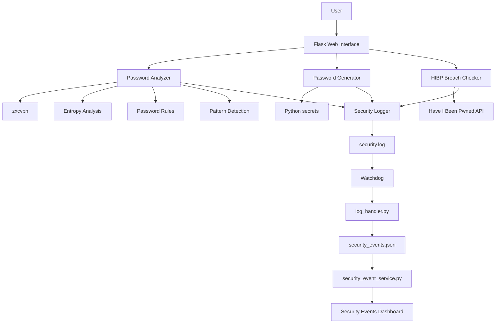

# 🔐 Password Security Analyzer

A Flask-based password security platform designed to help users understand, evaluate, and improve password security.

The project combines password strength analysis, entropy estimation, breach detection, secure password generation, and security-event monitoring into a single web application.

Rather than treating password security as simply a "strong" or "weak" label, the application provides several layers of analysis, including password patterns, estimated cracking time, number of guesses, zxcvbn feedback, password policy validation, and breach exposure.

The application also integrates with the **Have I Been Pwned (HIBP) API** for real-world breach intelligence and uses **Watchdog** to monitor security logs and turn security-relevant activity into structured events displayed through a dedicated dashboard.

---

## 📌 Project Overview

Weak and reused passwords remain one of the most common entry points in account compromise.

A password may appear complex while still being predictable because of dictionary words, repeated characters, keyboard patterns, sequences, dates, or other patterns commonly targeted by attackers.

This project was built to provide a more complete password-security assessment by combining:

* Password strength analysis
* Entropy estimation
* Pattern detection
* Password policy validation
* Crack-time estimation
* Breach intelligence
* Secure password generation
* Security logging
* File-based event monitoring
* Security event visualization

The goal is to provide users with meaningful security information instead of relying on a single strength score.

---

## ✨ Features

### 🔎 Password Security Analysis

The analyzer evaluates submitted passwords using multiple security indicators.

It provides:

* Strength score
* Entropy estimation
* Password policy validation
* zxcvbn feedback
* Estimated crack times
* Estimated number of guesses
* Detected password patterns
* Severity classification for detected patterns
* Human-readable security impact
* Overall security recommendations

Example pattern classifications include:

| Severity  | Pattern             | Security Impact                                  |
| --------- | ------------------- | ------------------------------------------------ |
| 🔴 High   | Dictionary Word     | Easily targeted by dictionary-based attacks      |
| 🟡 Medium | Character Sequence  | Sequential characters are predictable            |
| 🟡 Medium | Repeated Characters | Repetition reduces effective password complexity |
| 🟡 Medium | Keyboard Pattern    | Common keyboard paths can be targeted            |
| 🟡 Medium | Date Pattern        | Dates are commonly used and predictable          |
| 🟢 Low    | Random Characters   | No obvious pattern-based weakness detected       |

---

### 🛡️ Password Breach Detection

The application integrates with the **Have I Been Pwned API** to determine whether a password has appeared in known data breaches.

The password breach workflow uses the HIBP password-checking mechanism rather than sending the plaintext password directly to the service.

The application reports:

* Password not found in known breaches
* Password found in known breaches
* Number of breach occurrences
* API/network errors

The password itself is not written to application logs.

---

### 📧 Email Breach Checking

Users can optionally provide an email address to check whether it appears in known HIBP breach records.

The feature handles several possible states:

* Valid email
* Invalid email
* Breached email
* Email with no known breach
* Missing HIBP API key
* Invalid API key
* API/network errors
* Rate-limit responses

A valid HIBP API key is required for the email breach functionality.

The API key is supplied through environment configuration rather than being embedded in the source code.

---

### 🔑 Secure Password Generator

The project includes a configurable password generator.

Password generation uses Python's `secrets` module instead of the standard pseudo-random `random` module.

Users can configure:

* Password length
* Uppercase letters
* Lowercase letters
* Digits
* Symbols
* Exclusion of ambiguous characters

The generator can exclude characters such as:

```text
O 0 o I l 1
```

Generated passwords can immediately be analyzed using the password analyzer.

---

### 📋 Security Event Logging

Security-relevant application activity is recorded through a dedicated logging layer.

Events can originate from components such as:

* Password analysis
* Password generation
* Password breach checking
* Email breach checking
* HIBP API failures
* Invalid API credentials
* Rate-limit events

Sensitive information such as plaintext passwords and API keys should never be written to the security logs.

---

### 👁️ Watchdog Monitoring

The application uses **Watchdog** to monitor the security log for new entries.

The monitoring pipeline is:

```text
Application
     │
     ▼
  logger.py
     │
     ▼
security.log
     │
     ▼
  Watchdog
     │
     ▼
log_handler.py
     │
     ▼
security_events.json
     │
     ▼
security_event_service.py
     │
     ▼
Security Events Dashboard
```

This allows the application to turn normal log activity into structured security events.

---

### 📊 Security Events Dashboard

The application provides a dedicated security monitoring dashboard.

It displays:

* Total events
* 🔴 High events
* 🟠 Error events
* 🟡 Warning events
* 🔵 Informational events
* Recent security events
* Event type
* Severity
* Timestamp
* Source

The dashboard automatically checks for new events so that newly detected activity appears without requiring the user to manually refresh the page.

---

## 🏗️ Architecture



---

## 🧩 Project Structure

```text
pass/
│
├── app.py
├── requirements.txt
├── .env.example
├── .gitignore
├── README.md
│
├── modules/
│   ├── password_analyzer.py
│   └── password_generator.py
│
├── services/
│   ├── analysis_service.py
│   ├── breach_checker.py
│   ├── generator_service.py
│   ├── logger.py
│   ├── log_handler.py
│   ├── security_event_service.py
│   └── watchdog_service.py
│
├── templates/
│   ├── base.html
│   ├── analyze.html
│   ├── generator.html
│   ├── security_events.html
│   │
│   └── partials/
│       └── analysis_report.html
│
├── logs/
│   ├── security.log
│   └── security_events.json
│
└── docs/
    ├── setup.md
    ├── security.md
    └── screenshots/
```

Runtime log files should not be committed to the repository.

---

## 🛠️ Technology Stack

| Component                  | Technology                       |
| -------------------------- | -------------------------------- |
| Backend                    | Python                           |
| Web Framework              | Flask                            |
| Template Engine            | Jinja2                           |
| Frontend                   | HTML, CSS, Bootstrap, JavaScript |
| Password Analysis          | zxcvbn                           |
| Secure Password Generation | Python `secrets`                 |
| Hashing                    | Python `hashlib` / SHA-1         |
| Breach Intelligence        | Have I Been Pwned API            |
| File Monitoring            | Watchdog                         |
| Event Storage              | JSON                             |
| Logging                    | Python `logging`                 |

---

# 🚀 Installation

## Requirements

Before installing the project, make sure you have:

* Python 3.13 or newer
* pip
* Git
* Internet connectivity for HIBP checks
* A valid HIBP API key for email breach checking

---

## 1. Clone the Repository

```bash
git clone <repository-url>
cd pass
```

Replace `<repository-url>` with the actual GitHub repository URL.

---

## 2. Create a Virtual Environment

Linux/macOS:

```bash
python3 -m venv .venv
```

Activate it:

```bash
source .venv/bin/activate
```

Windows:

```powershell
python -m venv .venv
```

Activate:

```powershell
.venv\Scripts\activate
```

---

## 3. Install Dependencies

With the virtual environment activated:

```bash
pip install -r requirements.txt
```

The dependency list can be regenerated from the active environment with:

```bash
pip freeze > requirements.txt
```

---

## 4. Configure Environment Variables

Copy the example environment file:

```bash
cp .env.example .env
```

Edit the file:

```bash
nano .env
```

Configure the required values:

```env
HIBP_API_KEY=your_hibp_api_key
SECRET_KEY=your_secure_random_secret
FLASK_ENV=development
```

### HIBP API Key

The email breach checker requires a valid Have I Been Pwned API key.

The real API key should only be stored in `.env`.

**Never commit `.env` to GitHub.**

---

## 5. Create the Logs Directory

If it does not already exist:

```bash
mkdir -p logs
```

The application uses this directory for security logs and processed security events.

---

# ▶️ Running the Application

## Start Flask

From the project root:

```bash
python app.py
```

Flask will display the local address where the application is running.

---

## Start Watchdog

Watchdog runs separately from Flask.

Open another terminal:

```bash
cd pass
source .venv/bin/activate
python services/watchdog_service.py
```

Keep Watchdog running while using the application.

---

# 🖥️ Application Pages

## Password Analyzer

```text
/analyze
```

The analyzer provides:

* Password strength
* Entropy
* Password policy results
* Password breach status
* Email breach status
* zxcvbn feedback
* Crack-time estimates
* Estimated guesses
* Pattern analysis
* Security recommendations

---

## Password Generator

```text
/generator
```

The generator allows users to configure password characteristics and create a cryptographically secure password.

---

## Security Events

```text
/security-events
```

The security-event dashboard provides visibility into activity detected by the logging and Watchdog pipeline.

The dashboard automatically refreshes its event data.

---

# 🧪 Testing

A complete test should cover both normal and failure conditions.

## Password Analysis

Test:

* Weak password
* Strong password
* Dictionary password
* Repeated characters
* Sequential characters
* Keyboard patterns
* Date patterns
* Random password
* Breached password
* Non-breached password

---

## Password Generator

Test:

* Minimum supported length
* Maximum supported length
* Uppercase only
* Lowercase only
* Digits only
* Symbols
* Multiple character sets
* Ambiguous-character exclusion

Verify that generated passwords respect all selected options.

---

## Email Breach Checker

Test:

* Valid email
* Invalid email
* Breached email
* Non-breached email
* Missing API key
* Invalid API key
* API/network failure
* Rate limiting

---

## Watchdog

The Watchdog pipeline should be verified using:

```text
Application
    ↓
logger.py
    ↓
security.log
    ↓
Watchdog
    ↓
log_handler.py
    ↓
security_events.json
    ↓
security_event_service.py
    ↓
Security Events Dashboard
```

A generated security event should eventually appear on the dashboard automatically.

---

# 🔒 Security Considerations

Security is an important part of the project architecture.

## Passwords

Plaintext passwords should not be:

* Stored permanently
* Written to logs
* Included in URLs
* Included in error messages
* Exposed through debugging output

Password analysis should be performed in memory whenever possible.

---

## Password Generation

Password generation uses:

```python
secrets
```

instead of:

```python
random
```

because `secrets` is designed for security-sensitive random value generation.

---

## HIBP Password Checks

The password breach workflow is designed around the HIBP password API's k-anonymity model.

The application should not transmit the plaintext password to HIBP.

---

## HIBP API Keys

API keys must be treated as secrets.

They should:

* Be stored in `.env`
* Never be committed to Git
* Never appear in frontend code
* Never appear in security logs
* Never be printed in error messages

---

## Email Addresses

Email addresses are user-controlled sensitive information.

The application should avoid unnecessarily persisting complete email addresses in security logs or event records.

---

## Logging

Security logging should provide useful monitoring information without exposing secrets.

Logs should never contain:

```text
Plaintext passwords
HIBP API keys
Authentication credentials
Sensitive request payloads
```

---

## Watchdog

Watchdog monitors the application's security log and processes relevant events.

The event pipeline is intentionally separated into:

1. Logging
2. Monitoring
3. Event processing
4. Event storage
5. Event presentation

This separation makes the monitoring component easier to maintain and extend.

---

## Dashboard Security

Security-event data originates from log files and should therefore be treated as untrusted input.

The dashboard escapes event content before inserting it into the browser DOM.

This reduces the risk of malicious log content being interpreted as executable HTML or JavaScript.

---

## Flask Secret Key

The Flask `SECRET_KEY` should not be hard-coded.

Generate a secure value using Python:

```python
import secrets

print(secrets.token_hex(32))
```

Store the resulting value in `.env`.

---

## Debug Mode

Flask debugging should only be enabled during development.

Debug mode should not be enabled when deploying the application to an untrusted or production environment.

---

# 📁 Environment Configuration

The repository contains:

```text
.env.example
```

but the actual:

```text
.env
```

file is intentionally excluded from Git.

Example:

```env
HIBP_API_KEY=your_hibp_api_key
SECRET_KEY=your_secure_random_secret
FLASK_ENV=development
```


# 📚 Documentation

Additional documentation is available under:

```text
docs/
```

### Setup

See:

```text
docs/setup.md
```

for environment configuration and installation instructions.

### Security

See:

```text
docs/security.md
```

for the project's security considerations and sensitive-data handling practices.

---

# 🔄 Security Event Flow

The complete monitoring workflow is:

```text
┌──────────────────────────┐
│      Flask Application   │
└────────────┬─────────────┘
             │
             ▼
┌──────────────────────────┐
│       logger.py          │
└────────────┬─────────────┘
             │
             ▼
┌──────────────────────────┐
│     security.log         │
└────────────┬─────────────┘
             │
             ▼
┌──────────────────────────┐
│        Watchdog          │
└────────────┬─────────────┘
             │
             ▼
┌──────────────────────────┐
│     log_handler.py       │
└────────────┬─────────────┘
             │
             ▼
┌──────────────────────────┐
│ security_events.json     │
└────────────┬─────────────┘
             │
             ▼
┌──────────────────────────┐
│ security_event_service   │
└────────────┬─────────────┘
             │
             ▼
┌──────────────────────────┐
│ Security Events Dashboard│
└──────────────────────────┘
```

---

# 🎯 Project Goals

The project was developed around several practical security-engineering goals:

* Improve password-security awareness
* Provide meaningful password analysis
* Detect known breach exposure
* Generate stronger passwords
* Demonstrate secure API integration
* Practice security-focused logging
* Monitor application security events
* Build a simple security monitoring dashboard
* Apply secure handling of credentials and user input

---

# ⚠️ Disclaimer

This project is intended for **educational, development, and controlled security-testing purposes**.

The application relies on external breach intelligence provided by the Have I Been Pwned API. Breach results therefore depend on the availability, coverage, and behavior of that external service.

Do not use the application to process passwords, email addresses, or other sensitive information belonging to other users without appropriate authorization.

For production deployment, additional controls such as HTTPS, authentication, secure session management, a production WSGI server, access controls, rate limiting, centralized logging, and proper secret management should be implemented.

---

# 👨‍💻 Author

**Hassan Elbesry**

Cyber Security Intern | Junior Security Analyst

This project was developed as a practical security-engineering project covering password security, breach intelligence, secure credential generation, API integration, application logging, file monitoring, and security-event visualization.

---

# ⭐ Acknowledgements

This project makes use of several open-source technologies and security services, including:

* Flask
* zxcvbn
* Watchdog
* Have I Been Pwned
* Bootstrap
* Python `secrets`

Their respective licenses and terms should be reviewed before production or commercial deployment.

---

## License

Add the project's chosen license here.

For example:

```text
MIT License
```

if the repository is released under the MIT License.
